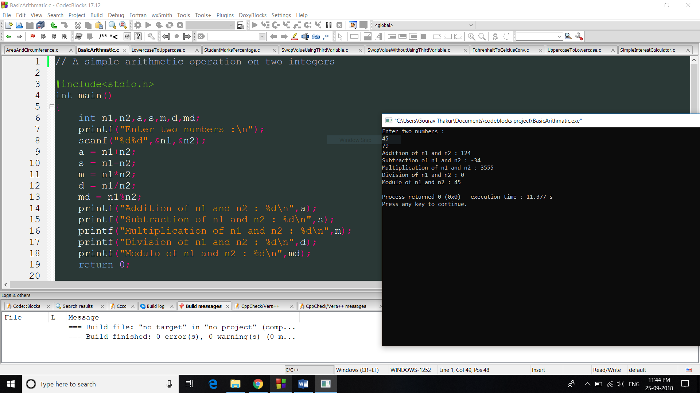

# C-Programming-Course-Phitron
This repo contains my learning and practice about C programming from phitron.io

The only way to learn a new programming language is by writing programs in it. - Dennis Ritchie

These program are written at codeblocks ide in windows. These programs are not very sophisticated as these are beginners friendly and have many bugs. Anyone who is new to c language can practice these examples. 

- Only programs written in c language will be merged.
- Beautify/Format your code before making a PR. Poorly stuctured code with inconsistent spacing and bad variable name will not be merged. 
- Use this tool to beautify your code : https://codebeautify.org/c-formatter-beautifier
- Make sure your program works after beautifying it.
- #include< stdio.h > is wrong and you must remove whitespaces. #include<stdio.h> is correct.
- Please check your spellings before making a PR
- Comment code properly.

## প্রোগামিং বই (Prgramming Books):

- [কম্পিউটার প্রোগ্রামিং বই](http://cpbook.subeen.com/)-Tamim Shahriar

- [C Programming Absolute Beginner's Guide](https://usermanual.wiki/Pdf/CProgrammingAbsoluteBeginnersGuide3rdEditio.424140197.pdf)

- [Dawn of Programming Contest](https://docs.google.com/viewer?a=v&pid=sites&srcid=ZGVmYXVsdGRvbWFpbnxzaGFudG84NnxneDplNjM5ZjhlYzYxMWY1N2Q)

- [Data Structures And Algorithms Roadmap](https://github.com/yuvrajverma01/Data-Structures-And-Algorithms-Roadmap)

- [52 Programming Problems and Solution](https://drive.google.com/file/d/1ZvkZOrdpJezviiUGHKmy2BNivtygASsT/view?fbclid=IwAR0cmTdxl8Z6oI-OtTO0wQ5blYZQqLnWsuOPypolDJLs6d-XYncQUeEZmdQ)

- [CP Computer Programming- Tamim Shariar Subeen](https://docs.google.com/file/d/0B2ntYqCgNmgJakVVUDVHR005ZTQ/edit?resourcekey=0-qCavR3wlTDFQ4JLBWrCBbw)

- [50 Basic Programes](https://mycareerwise.com/programming/category/basic-programs)

## Contributing

This is a self learning project for myself.

Please feel free to fork this repo. Pull request to submit more programs.
